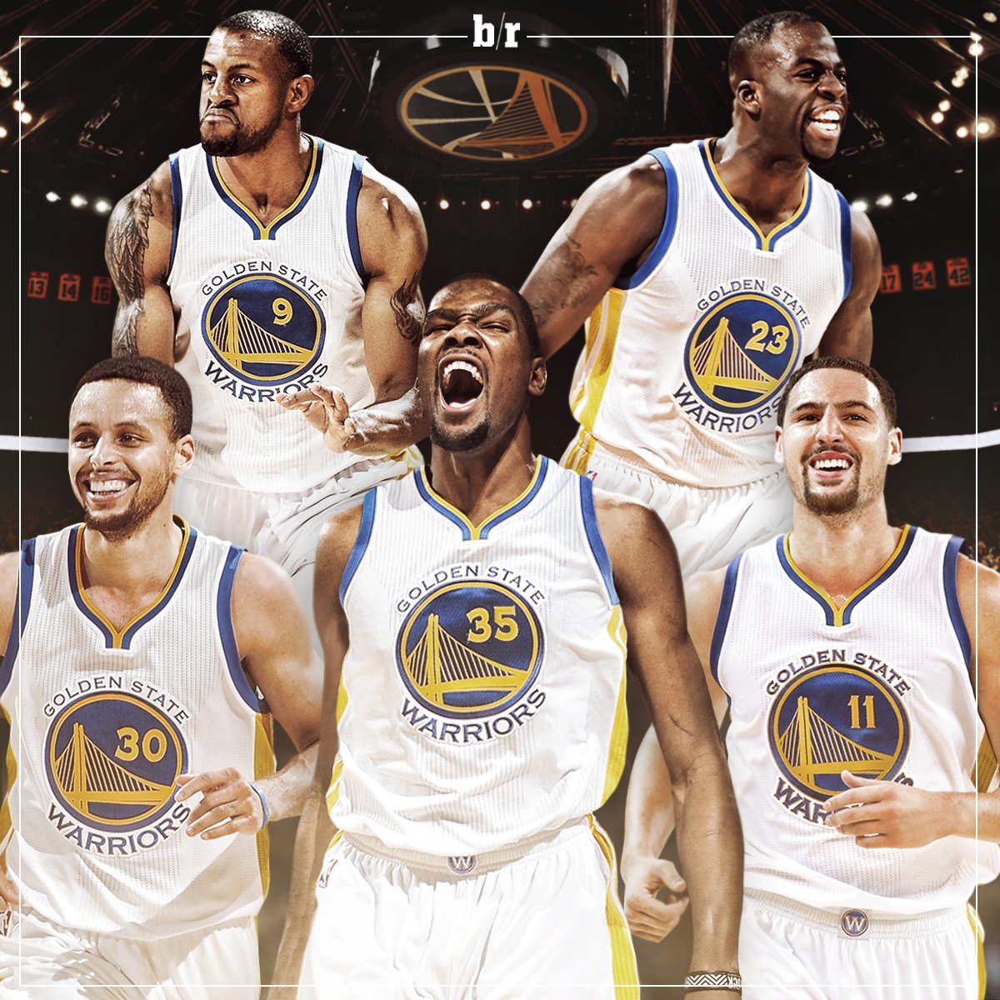
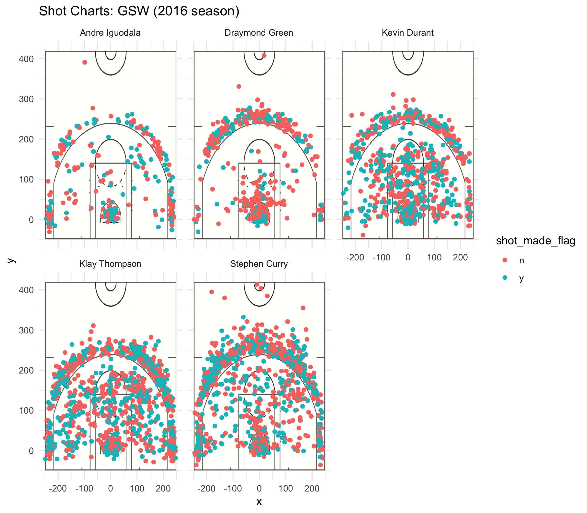

# Report

The Golden State Warriors are known for being the top team in the NBA with many All-Star level players. In 2016, they had an amazing regular season performance. In this report, we will be examining the shots data of five players on the Golden State Warriors during the 2016 NBA season. The players are Stephen Curry, Klay Thompson, Kevin Durant, Draymond Green, and Andre Iguodala. The purpose of this report is to discover where each of these players is shooting from and which areas they are making shots. We also want to find out what each of their shooting percentages is for both two point shots and three point shots.

```{r out.width='80%', echo=FALSE, fig.align='center'}

```
GSW players displayed above. Picture from Bleacher Report

## Motivation

The motivation for this report is that we want to find out the strengths and weaknessess of each of the five players on the Warriors. All five of the players shoot two pointers and three pointers with some shooting more three pointers than other players and some shooting more two pointers than other players. The players also shoot from all across the basketball court.  We want to see which spots they tend to make more shots and which spots they tend to miss more shots. We also have data on which time each shot was attempted so we can also take a look at what point in the game some players tend to start attempting more shots.

## Data

The data we have for the Golden State Warriors NBA players describes all of the shots they attempted during the 2016 season. For each player, each row of data describes a shot that they took during an NBA game. Our data had 14 columns or variables for each player. These variables describe the type of shot (two point or three point shot), the NBA game, the opposing team, the position on the court, if the shot was successful, and the time at which the shot was attempted. Some players had more rows than others, showing that some players had attempted more shots during the season than other players.

## Analysis

We did different types of analysis on the data. We computed summaries for each player that displayed the mean, minimum, maximum, median, and quartiles for many different variables in the dataset. In addition, with the x and y coordinates for each shot, we created a graph with an NBA court background that displayed the exact location where the shot was attempted for each player. These graphs are displayed below:

```{r out.width='80%', echo=FALSE, fig.align='center'}

```

For each graph, we have also shown which shot attempts were successful and which shot attempts were not. 

In addition, we also computed shooting percentages for each player. These percentages can be seen in this table.

```{r echo=FALSE, warning=FALSE}
library(dplyr)
data <- read.csv("../data/shots-data.csv", stringsAsFactors = FALSE)

twopt <- data %>% group_by(name) %>% 
  filter(shot_type == "2PT Field Goal") %>%
  summarise(total = n(), made = sum(shot_made_flag == "shot_yes"), perc_made = made / total) %>%
  arrange(desc(perc_made))

threept <- data %>% group_by(name) %>% 
  filter(shot_type == "3PT Field Goal") %>%
  summarise(total = n(), made = sum(shot_made_flag == "shot_yes"), perc_made = made / total) %>%
  arrange(desc(perc_made))

combined <- data %>% group_by(name) %>% 
  summarise(total = n(), made = sum(shot_made_flag == "shot_yes"), perc_made = made / total) %>%
  arrange(desc(perc_made))
```

2PT Effective Shooting % by Player
```{r echo=FALSE}
twopt
```
3PT Effective Shooting % by Player
```{r echo=FALSE}
threept
```
Effective Shooting % by Player
```{r echo=FALSE}
combined
```


In the tables, you can see that the column total indicates the total shots attempted, the column made indicates the shots that were successful, and the column perc_made has the percentage of shots made. We made tables for two point shooting, three point shooting, and overall shooting. 

## Discussion

From the graphs of the basketball shots, we can see where each player was more successful shooting on the court. We also see that some players have a lot more data points (shot attempts) than other players. For example, we can see that Andre Iguodala and Draymond Green seem to have less data points on their graphs than the other three players. From the graphs, we also see that Stephen Curry has a high amount of points centered around the three point line, showing that he attempts the most three pointers out of all the players. Klay Thompson seems to have a high volume of data points at the three point line and in the middle and close to the hoop, showing he attempts many different kinds of shots. Kevin Durant's graph also shows he attempts many three pointers but shows that he attempts many more two point shots. The graph also shows a high concentration of successful shots on the upper right side of the three point line for Klay Thompson, showing that he generally makes shots he attempts from that area. We can also see a high concentration of successful shots for Stephen Curry on the upper left side and in the corners, showing his strength from shooting in those areas. Draymond Green and Kevin Durant's shot charts interestingly show that they both tend to shoot three pointers from the top of the three point line and do not shoot three pointers from the corners very often.

From the three graphs with the shooting percentages, we can see that Andre Iguodala has the best shooting percentage for two points but has the least amount of shots attempted. Klay Thompson has the best three point shooting percentage and Kevin Durant has the best overall percentage. 

In addition, from the summary of each of the five datasets, we get some statistics on the time at which shots were attempted, which is something we don't get from the charts or the tables. From those statistics, we see that the mean at which most of the players took their shots was around 22 minutes but the mean for Andre Iguodala was around 25 minutes. This could suggest that Andre Iguodala comes into the game later than the other four players.

## Conclusions

Some of the conclusions we can make from the data tables with shooting percentage is that Stephen Curry and Klay Thompson seem to be the most efficient at three point shooting and three point shooting seems to be their strength. We see from the shot charts that sometimes they tend to take shots that are far from even the three point line. We can also suggest that Kevin Durant seems to be the best all-round player with both types of shooting due to having the best overall shooting percentage. His shot chart also shows his shots evenly distributed throughout the NBA court. We can also conclude that Andre Iguodala gets much less shot opportunities than the other four players. 

## Summary

In this report, we examined and analyzed data from five NBA players on the Golden State Warriors. We created shot charts showing the areas where each player liked to take shots and which areas of the court they were more successful with their shots. We found that some players on the Warriors attempted many more shots than other players and that players like Stephen Curry and Klay Thompson tended to shoot from longer distances and were effective at shooting from long distance. Some players like Draymond Green and Kevin Durant were great at middle range shots and were generally good at taking all different kinds of shots. We ultimately saw that the five players were skilled at different shots and areas from the court and put together could cover for each other's weaknesses.